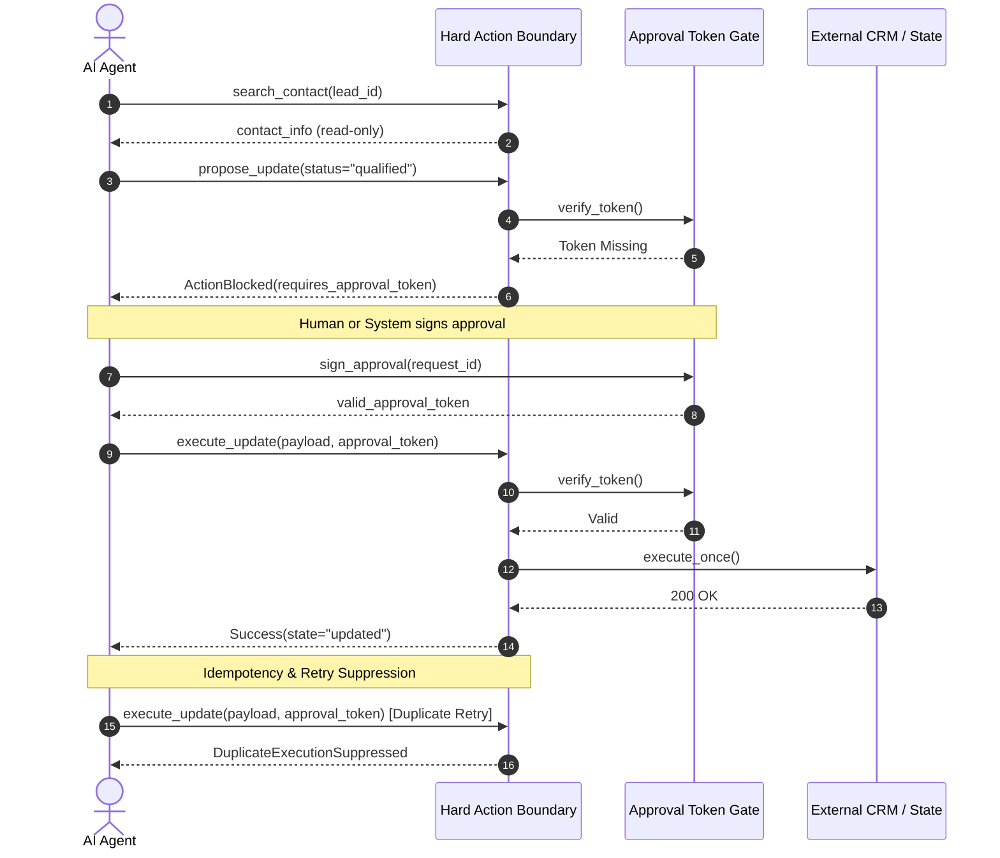
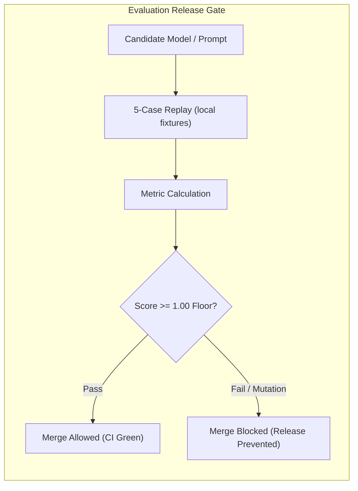

# llm-reviewer-path

**A cloneable, 10-minute hiring-manager index for dependable agent systems.**

Inspect the evidence, rerun the receipts, and check how failure is handled. The path runs without API keys or network access. Fourteen offline tests cover an evaluation gate, approval-token isolation for hard actions, and retrieval failure modes.

<p align="center">
  
</p>

```bash
git clone https://github.com/ChunkyTortoise/llm-reviewer-path
cd llm-reviewer-path
uv run pytest
```

No API key. No network. 14 offline unit tests verify evaluation gating, approval-token hard action isolation, and retrieval failure modes in ~0.01s.

<details>
<summary><b>View expected terminal output (14 passed in 0.01s)</b></summary>

```text
============================= test session starts ==============================
platform darwin -- Python 3.13.11, pytest-9.1.1, pluggy-1.6.0
collected 14 items

tests/test_eval_gate.py ...                                              [ 21%]
tests/test_hard_action.py .....                                          [ 57%]
tests/test_missing_fixture_fails_closed.py .                             [ 64%]
tests/test_retrieval_failure_modes.py .....                              [100%]

============================== 14 passed in 0.01s ==============================
```

</details>

## Start with evidence

| Step | Inspect | What the evidence shows |
|---:|---|---|
| 1 | [Provenance table](#provenance) | Where the public evidence comes from |
| 2 | [Eval-gate receipt](#eval-gate-receipt) | A good candidate passes and a mutation fails |
| 3 | [Hard-action receipt](#hard-action-receipt) | Proposal, denial without approval, signed approval, one execution, and duplicate retry suppression |
| 4 | [Retrieval failure modes](#retrieval-failure-modes) | Offline tests for retrieval failure behavior |
| 5 | [Field-engineering scope receipt](#field-engineering-scope-receipt) | An anonymized scope artifact |

> **Evidence boundary:** This repository is an index, not a product or RAG app. It documents the offline tests and receipts listed above. It does not claim unlisted production behavior, client details, metrics, or features.

## Architecture & Approval Boundaries

### Hard-action receipt
Demonstrates runtime isolation of dangerous side effects (CRM updates, external calls) behind a cryptographic approval-token gate with duplicate suppression:



### Eval-gate receipt
Demonstrates how offline fixture replays act as strict deployment and merge gates:



## Provenance

| Claim | Source | Extracted | Newly added |
|---|---|---|---|
| Retrieval failure modes + eval gate | [DocExtract](https://github.com/ChunkyTortoise/docextract) `scripts/eval_offline_replay.py`, `scripts/eval_gate.py`, [ADR-0020](https://github.com/ChunkyTortoise/docextract/blob/main/docs/adr/0020-indirect-prompt-injection-defense.md) | Failure classes and eval-as-merge-block | Mock retriever and local fixtures |
| Hard action rule | `receipts/hard_action/loop.py` | Retry and failure isolation pattern | Approval-token boundary (`new in this repo`) |
| Intentional-fail eval | DocExtract [PR #32](https://github.com/ChunkyTortoise/docextract/pull/32) | Red-gate idea | In-repo mutation so default CI stays green |
| FDE scoping story | [jorge_real_estate_bots](https://github.com/ChunkyTortoise/jorge_real_estate_bots) | Paid Acuity facts in METRICS-SOT | Redacted markdown only |

## JD matrix

| JD signal | Local receipt | Command or file | Parent proof |
|---|---|---|---|
| Eval as release gate | `receipts/eval_gate` | `uv run pytest tests/test_eval_gate.py` | DocExtract eval-gate workflow |
| Hard action rule | `receipts/hard_action` | `uv run pytest tests/test_hard_action.py` | Local retry boundary; approval token is new here |
| Retrieval failure modes | `receipts/retrieval_failure_modes` | `uv run pytest tests/test_retrieval_failure_modes.py` | DocExtract adversarial / ADR-0020 |
| FDE scoping | `receipts/fde_scope/ACUITY.md` | read (narrative, not pytest) | jorge_real_estate_bots |

## Walk (10 minutes)

1. Provenance table and parents above.
2. Eval gate: good candidate passes; `MUTATION` is rejected; default CI is green because that rejection is expected.
3. Hard action: `search_contact -> propose_update -> denied_without_approval -> approved -> execute_once -> duplicate_retry_suppressed`.

### Retrieval failure modes

Retrieval failure-mode tests extracted from DocExtract. Mock retriever, no network. This is a test suite, not a RAG app.

### Field-engineering scope receipt

Narrative receipt: `receipts/fde_scope/ACUITY.md`.

Parents stay the production systems. This repo is the cloneable index.
