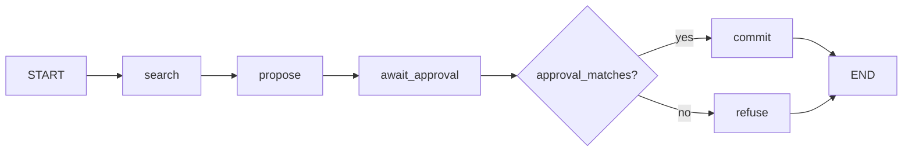
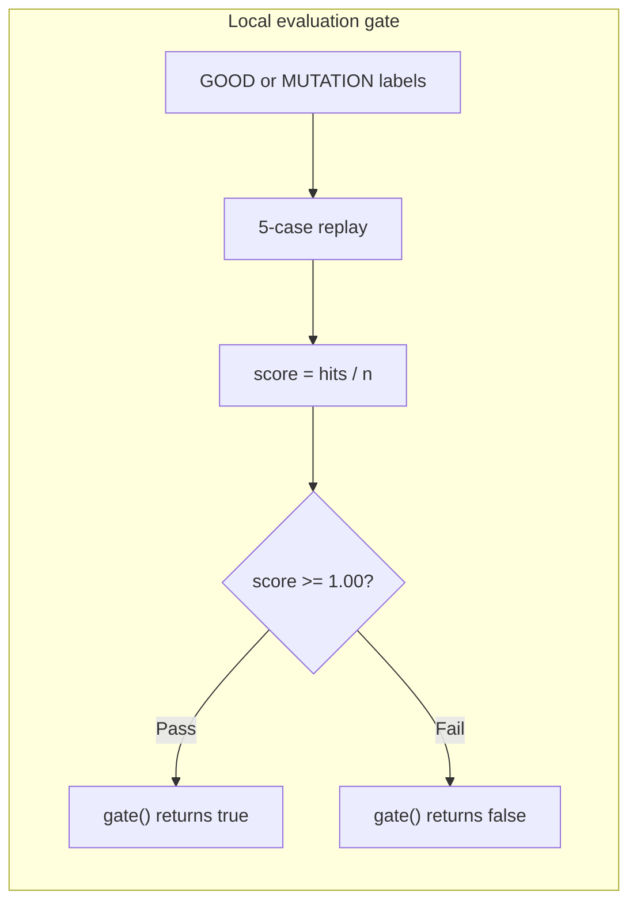

# llm-reviewer-path

**A hiring manager can clone this index, rerun 18 offline tests, and read the receipts in about 10 minutes.** Use it when screening AI Engineer, Applied AI, and AI Backend contract roles: an eval gate, an approval boundary before a write, retrieval failure modes, and a local LangGraph flow over that approval boundary. No API key. No network.

This repository is an index, not a product. [DocExtract](https://github.com/ChunkyTortoise/docextract) stays the production system for the eval and retrieval claims below.

[](https://github.com/ChunkyTortoise/llm-reviewer-path/actions/workflows/ci.yml)

<p align="center">
  
</p>

## Run

Python 3.10 or newer, and [uv](https://docs.astral.sh/uv/getting-started/installation/). There is no Makefile. The commands match `pyproject.toml` (`requires-python`, dev group `pytest>=8`, `addopts = "-q"`) and [`.github/workflows/ci.yml`](.github/workflows/ci.yml) (`uv sync --group dev`, then `uv run pytest`).

```bash
git clone https://github.com/ChunkyTortoise/llm-reviewer-path.git
cd llm-reviewer-path
uv sync --group dev
uv run pytest
```

`uv.lock` pins pytest 9.1.1 and langgraph 1.2.12. Quiet mode hides the platform and Python banner.

<details>
<summary><b>Expected terminal output (18 passed)</b></summary>

80-column capture. The stable result is `18 passed`. The seconds value moves (this capture was 0.20s).

```text
..................                                                       [100%]
18 passed in 0.20s
```

| File | Tests |
|---|---:|
| `tests/test_agent_flow.py` | 4 |
| `tests/test_eval_gate.py` | 3 |
| `tests/test_hard_action.py` | 5 |
| `tests/test_missing_fixture_fails_closed.py` | 1 |
| `tests/test_retrieval_failure_modes.py` | 5 |
| **Total** | **18** |

</details>

> **Evidence boundary:** This repository is an index, not a product or a RAG app. It documents the offline tests and receipts below. It does not claim unlisted production behavior, client details, metrics, or features. The local eval gate is a boolean on 5 fixtures. It is not branch protection on DocExtract.

## JD matrix

| Hiring signal | What the local receipt shows | Command or file | Parent proof |
|---|---|---|---|
| Eval as a CI check | 5 labels, floor `1.00`. `GOOD` scores 1.00 and `gate()` is true. `MUTATION` labels the injection case as clean and `gate()` is false. An unknown case id raises `KeyError` (the run fails closed; it does not skip). | `uv run pytest tests/test_eval_gate.py tests/test_missing_fixture_fails_closed.py` (4 tests) | [`scripts/eval_offline_replay.py`](https://github.com/ChunkyTortoise/docextract/blob/main/scripts/eval_offline_replay.py) (`--floor 0.85`), [`scripts/eval_gate.py`](https://github.com/ChunkyTortoise/docextract/blob/main/scripts/eval_gate.py) (exit 1 on a threshold breach), [`eval-gate.yml`](https://github.com/ChunkyTortoise/docextract/blob/main/.github/workflows/eval-gate.yml), [`docs/eval-gate-proof.md`](https://github.com/ChunkyTortoise/docextract/blob/main/docs/eval-gate-proof.md), open red PR [#32](https://github.com/ChunkyTortoise/docextract/pull/32). This index does not change DocExtract branch protection. DocExtract records that a 2026-09-19 audit found the default branch unprotected. |
| Approval boundary on writes | `search_contact` needs no token. `propose_update` returns a preview. `execute` with no token returns `denied_without_approval`. Model-written approval text raises `ApprovalError`. `issue_approval` mints a token; `execute` with that token returns `execute_once` once, then `duplicate_retry_suppressed`. The compare uses `secrets.compare_digest`. The contact row is in memory, not a live CRM call. | `uv run pytest tests/test_hard_action.py` (5 tests) | None. The approval-token boundary is local to this index. |
| Agent flow (LangGraph, local) | `StateGraph` nodes `search`, `propose`, `await_approval`, then a conditional edge. Resume `{"approval": None}` takes `refuse` and returns `denied_without_approval` (contact city stays `NY`). Model text resumes into `refuse` and returns `denied_untrusted_approval`. `issue_approval`, then resume with that token, takes `commit` and returns `execute_once`. A second `execute` on the same loop returns `duplicate_retry_suppressed`. An unknown contact raises `KeyError` before a preview. Checkpointer is `InMemorySaver`. No model call. | `uv run pytest tests/test_agent_flow.py` (4 tests) | None. Local graph over `receipts/hard_action/loop.py`. Not a production agent runtime and not GitLab Duo. |
| Retrieval failure modes | Mock `classify()` on 5 fixtures: `empty_retrieval`, `conflicting_evidence`, `prompt_injection`, `malformed_structured_output`, and one clean pass. No network. | `uv run pytest tests/test_retrieval_failure_modes.py` (5 tests) | Indirect prompt injection in untrusted document text: [ADR-0020](https://github.com/ChunkyTortoise/docextract/blob/main/docs/adr/0020-indirect-prompt-injection-defense.md) and the prompt-injection row in [`docs/eval-failure-analysis.md`](https://github.com/ChunkyTortoise/docextract/blob/main/docs/eval-failure-analysis.md). The parent control is [`app/services/injection_guard.py`](https://github.com/ChunkyTortoise/docextract/blob/main/app/services/injection_guard.py). `receipts/retrieval_failure_modes/retriever.py` is a local mock, not that guard. |
| Field-engineering scope | Redacted scope note: customer problem, constraints, first slice, exclusions, kill-check, and handoff. Pytest does not collect it. | [`receipts/fde_scope/ACUITY.md`](receipts/fde_scope/ACUITY.md) | `ChunkyTortoise/jorge_real_estate_bots` is not a public repository (HTTP 404). `METRICS-SOT.md` is not in this repo. The markdown in this index is the receipt. |

## Architecture and approval boundaries

### Hard-action receipt

`receipts/hard_action/loop.py` isolates a write behind an approval token. Reads stay open. A preview is not an execution. Text from the model is not a token. A used token cannot run the write again. The updated row lives in an in-memory dict.

```mermaid
sequenceDiagram
    autonumber
    actor Approver
    actor Agent
    participant Loop as ActionLoop

    Agent->>Loop: search_contact("ada")
    Loop-->>Agent: ok, contact fields

    Agent->>Loop: propose_update("ada", patch)
    Loop-->>Agent: status=preview, preview_id

    Agent->>Loop: execute(preview_id, approval=None)
    Loop-->>Agent: denied_without_approval

    Agent->>Loop: execute(preview_id, model text)
    Loop-->>Agent: ApprovalError untrusted approval

    Approver->>Loop: issue_approval(preview_id)
    Loop-->>Approver: tok_...

    Agent->>Loop: execute(preview_id, token)
    Loop-->>Agent: execute_once

    Agent->>Loop: execute(preview_id, token)
    Loop-->>Agent: duplicate_retry_suppressed
```

### Agent-flow receipt

`receipts/agent_flow/flow.py` compiles a LangGraph `StateGraph` on the same in-memory `ActionLoop`. `search` reads a contact. `propose` stores a preview. `await_approval` pauses on `interrupt` until the caller resumes with `{"approval": ...}`. The conditional edge calls `approval_matches` (`secrets.compare_digest`). Missing and model-written approvals take `refuse` and do not write. An issued token takes `commit`, which calls `execute`. The checkpointer is `InMemorySaver` (process memory for this receipt). There is no model client.



### Eval-gate receipt

`receipts/eval_gate/gate.py` scores five local labels. `gate()` returns true only when `score >= 1.00`. Default CI on this repo stays green because the mutation test expects `gate()` to be false. That is a different demonstration from DocExtract PR #32, which is left open so the parent workflow stays red.



Unknown case ids never reach that floor check. `evaluate()` raises `KeyError` first (`tests/test_missing_fixture_fails_closed.py`).

## Provenance

Checked against DocExtract `main` and the public GitHub account on 2026-09-23.

| Claim | Source | Taken from the parent | Added in this repo |
|---|---|---|---|
| Eval gate | DocExtract [`scripts/eval_offline_replay.py`](https://github.com/ChunkyTortoise/docextract/blob/main/scripts/eval_offline_replay.py), [`scripts/eval_gate.py`](https://github.com/ChunkyTortoise/docextract/blob/main/scripts/eval_gate.py), [`docs/eval-gate-proof.md`](https://github.com/ChunkyTortoise/docextract/blob/main/docs/eval-gate-proof.md), [PR #32](https://github.com/ChunkyTortoise/docextract/pull/32) | Offline replay as a CI check, and a public red regression | 5-label floor at 1.00. The mutation is asserted here, so this repo's CI stays green. |
| Retrieval failure modes | DocExtract [ADR-0020](https://github.com/ChunkyTortoise/docextract/blob/main/docs/adr/0020-indirect-prompt-injection-defense.md), [`docs/eval-failure-analysis.md`](https://github.com/ChunkyTortoise/docextract/blob/main/docs/eval-failure-analysis.md) | Indirect prompt injection in untrusted document text | Local mock and five fixtures: empty, conflict, injection, malformed, clean |
| Hard action | `receipts/hard_action/loop.py` | No DocExtract parent | Approval token, denial, `compare_digest`, one execution, duplicate suppression |
| Agent flow | `receipts/agent_flow/flow.py` | No DocExtract parent. Not GitLab Duo. | Local `StateGraph` over `ActionLoop`: interrupt, `approval_matches`, refuse, or one `execute` |
| FDE scoping | [`receipts/fde_scope/ACUITY.md`](receipts/fde_scope/ACUITY.md) | `ChunkyTortoise/jorge_real_estate_bots` is not public (HTTP 404). `METRICS-SOT.md` is not in this repo. | Redacted markdown only. Not a pytest. |

## Walk (10 minutes)

1. Run the clone, `uv sync --group dev`, and `uv run pytest`. Confirm `18 passed`.
2. Read the provenance table before treating any parent number as a result from this repo.
3. Eval gate: `GOOD` passes, `MUTATION` fails, an unknown id raises `KeyError`.
4. Hard action: `search_contact`, `propose_update`, `denied_without_approval`, `ApprovalError` on model text, `issue_approval`, `execute_once`, `duplicate_retry_suppressed`.
5. Retrieval: five fixture ids in `receipts/retrieval_failure_modes/cases.py`.
6. Scope: read `receipts/fde_scope/ACUITY.md`. It is narrative. The public parent URL is not available.
7. Agent flow: pause at `await_approval`. No token refuses. Model text refuses. An issued token runs `execute_once`, then the same loop suppresses a retry.

Parents that are public stay the production systems. This repo is the cloneable index.
