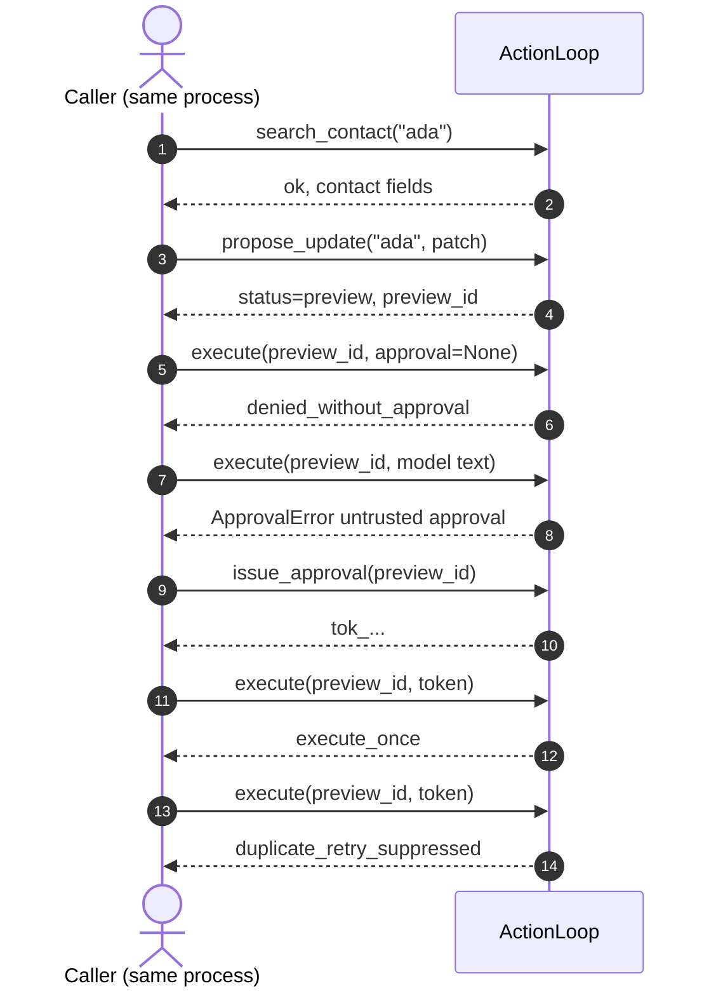
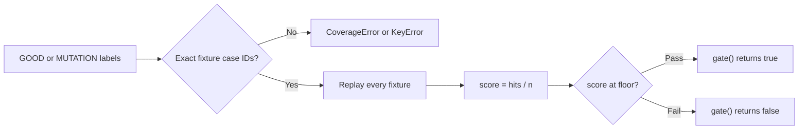

# llm-reviewer-path: eval gates, approval-bound writes, idempotent retries

**A 10-minute runnable code sample: an eval gate fails when a label set disagrees with the classifier (a mutated label set marks a prompt injection as clean), a write runs only with an issued approval token, and a retried write is suppressed instead of applied twice.** Everything runs offline on local fixtures, with no API keys.

[](https://github.com/ChunkyTortoise/llm-reviewer-path/actions/workflows/ci.yml)
[](pyproject.toml)
[](LICENSE)

<p align="center">
  
</p>
<p align="center"><sub>Editorial summary of the replay output (<a href="#quickstart-10-minutes">Quickstart</a>). Full output and figure provenance: <a href="docs/offline-receipt.md">docs/offline-receipt.md</a>.</sub></p>

## Results

| Kind | Result | Value | Source |
|---|---|---|---|
| CI gate | Eval floor: `gate()` passes only at this score, and only with the complete fixture set | **1.00** | [`gate.py#L6`](receipts/eval_gate/gate.py#L6) (`THRESHOLD`) |
| Measured | Correct label set vs. mutated label set (injection case marked clean), scored against the classifier | **1.00 pass / 0.80 fail** | [`offline-receipt.md#L16-L17`](docs/offline-receipt.md#L16-L17) · [`test_eval_gate.py`](tests/test_eval_gate.py) |
| Measured | Writes applied when an approved write is retried with the same token | **1** (retry returns `duplicate_retry_suppressed`) | [`test_hard_action.py#L94-L103`](tests/test_hard_action.py#L94-L103) |
| Inventory | Failure-mode fixtures: empty retrieval, conflicting evidence, prompt injection, malformed structured output, clean | **5** | [`cases.py#L11-L29`](receipts/retrieval_failure_modes/cases.py#L11-L29) |
| CI gate | Offline tests, run by CI on every push and pull request | **36** | [`ci.yml`](.github/workflows/ci.yml) · [`tests/`](tests/) · [`offline-receipt.md#L27`](docs/offline-receipt.md#L27) |

This table is the one place each number is stated. The scope of each one is in [Methodology & limits](#methodology--limits).

## Quickstart (10 minutes)

No API key and no network access after setup. Python 3.10+ and [uv](https://docs.astral.sh/uv/getting-started/installation/):

```bash
git clone https://github.com/ChunkyTortoise/llm-reviewer-path.git
cd llm-reviewer-path
uv sync --group dev
uv run pytest
uv run python -m receipts
```

Without uv, a plain virtual environment works too:

```bash
python3 -m venv .venv
.venv/bin/python -m pip install pytest
.venv/bin/python -m pytest
.venv/bin/python -m receipts
```

`pytest` should report every test passing (count in [Results](#results)). `python -m receipts` replays the eval scores and the approval sequence; its output must match the block in [docs/offline-receipt.md](docs/offline-receipt.md), and a test fails if it drifts.

Then read the code in this order:

1. **Eval gate:** [`receipts/eval_gate/gate.py`](receipts/eval_gate/gate.py). `GOOD` passes, `MUTATION` fails, incomplete labels raise `CoverageError`, unknown IDs raise `KeyError`.
2. **Approval-bound write:** [`receipts/hard_action/loop.py`](receipts/hard_action/loop.py). Denied without a token, `ApprovalError` on model text, `execute_once`, then `duplicate_retry_suppressed`.
3. **Failure-mode fixtures:** [`receipts/retrieval_failure_modes/cases.py`](receipts/retrieval_failure_modes/cases.py) and the mock classifier in [`retriever.py`](receipts/retrieval_failure_modes/retriever.py).

## How it works


```mermaid
sequenceDiagram
    autonumber
    actor Caller as Caller (same process)
    participant Boundary as ActionLoop

    Caller->>Boundary: search_contact("ada")
    Boundary-->>Caller: ok, contact fields

    Caller->>Boundary: propose_update("ada", patch)
    Boundary-->>Caller: status=preview, preview_id

    Caller->>Boundary: execute(preview_id, approval=None)
    Boundary-->>Caller: denied_without_approval

    Caller->>Boundary: execute(preview_id, model text)
    Boundary-->>Caller: ApprovalError untrusted approval

    Caller->>Boundary: issue_approval(preview_id)
    Boundary-->>Caller: tok_...

    Caller->>Boundary: execute(preview_id, token)
    Boundary-->>Caller: execute_once

    Caller->>Boundary: execute(preview_id, token)
    Boundary-->>Caller: duplicate_retry_suppressed
```

- **Reads are open, writes are previews.** `search_contact` needs no token. `propose_update` returns a preview and a `preview_id`; a preview is not an execution ([`loop.py`](receipts/hard_action/loop.py)).
- **Only an issued token executes.** `execute` without a token returns `denied_without_approval`. Model-written approval text raises `ApprovalError`. Tokens are compared with `secrets.compare_digest`.
- **Approval is bound to what was approved.** The token is bound to a snapshot of the target query and patch, and incoming and returned patches are copied. If the stored proposal changes after approval, `execute` raises `ApprovalError` before any write.
- **Retries are idempotent.** A used token cannot run the write again: a second `execute` returns `duplicate_retry_suppressed` and does not reapply the patch, even if the row changed in between. Every step is appended to an audit list.
- **The eval gate fails closed.** `evaluate()` scores a candidate's labels against a mock `classify()` over the fixed fixtures ([`gate.py`](receipts/eval_gate/gate.py)). `gate()` requires the exact case IDs, the full count, and a score at the floor, including for externally constructed reports.

## How it's evaluated


```mermaid
flowchart LR
    Cand["GOOD or MUTATION labels"] --> Coverage{"Exact fixture case IDs?"}
    Coverage -->|No| Reject["CoverageError or KeyError"]
    Coverage -->|Yes| Replay["Replay every fixture"]
    Replay --> Eval["score = hits / n"]
    Eval --> Floor{"score at floor?"}
    Floor -->|Pass| Allow["gate() returns true"]
    Floor -->|Fail| Block["gate() returns false"]
```

| Signal | What runs | Command |
|---|---|---|
| **Eval gate** | `GOOD` must pass and `MUTATION` must fail; the mutation is asserted, so a gate that stopped catching it would turn CI red | `uv run pytest tests/test_eval_gate.py` |
| **Fail-closed coverage** | Every single omission, empty or partial label sets, unknown IDs, and malformed external reports are rejected before or at the gate | `uv run pytest tests/test_missing_fixture_fails_closed.py` |
| **Approval boundary** | Denial, model-text rejection, copied patches, changed-proposal rejection, one execution, duplicate suppression | `uv run pytest tests/test_hard_action.py` |
| **Failure-mode fixtures** | Mock `classify()` on each fixture, no network | `uv run pytest tests/test_retrieval_failure_modes.py` |
| **Replay receipt** | `python -m receipts` output must equal the documented block and must not print tokens | `uv run pytest tests/test_replay.py` |

CI ([`.github/workflows/ci.yml`](.github/workflows/ci.yml)) runs `uv sync --group dev` and `uv run pytest` on every push and pull request. Per-module commands are also in [docs/verification-commands.md](docs/verification-commands.md).

## Design decisions

- **Assert the mutation instead of shipping a red build.** The gate demo keeps CI green by testing that `gate()` rejects `MUTATION`, so a regression in the gate itself is what fails CI ([`test_eval_gate.py`](tests/test_eval_gate.py)).
- **Fail closed on coverage.** A candidate that skips a fixture raises `CoverageError` and an unknown ID raises `KeyError` before scoring, so a partial run can never clear the floor ([`test_missing_fixture_fails_closed.py`](tests/test_missing_fixture_fails_closed.py)).
- **Model text is never an approval.** Approval is a token minted by `issue_approval` and compared in constant time, not a string the model can write ([`loop.py`](receipts/hard_action/loop.py)).
- **Bind the token to a snapshot.** Approving a preview approves that query and patch only; any later change is rejected before the write.

These patterns come from the full systems:

| Pattern | Source |
|---|---|
| Offline replay as a CI check | DocExtract [offline replay](https://github.com/ChunkyTortoise/docextract/blob/main/scripts/eval_offline_replay.py), [gate](https://github.com/ChunkyTortoise/docextract/blob/main/scripts/eval_gate.py), [gate proof](https://github.com/ChunkyTortoise/docextract/blob/main/docs/eval-gate-proof.md), [workflow](https://github.com/ChunkyTortoise/docextract/blob/main/.github/workflows/eval-gate.yml), [PR #32](https://github.com/ChunkyTortoise/docextract/pull/32) |
| Indirect prompt injection in untrusted document text | DocExtract [ADR-0020](https://github.com/ChunkyTortoise/docextract/blob/main/docs/adr/0020-indirect-prompt-injection-defense.md), [failure analysis](https://github.com/ChunkyTortoise/docextract/blob/main/docs/eval-failure-analysis.md), [injection guard](https://github.com/ChunkyTortoise/docextract/blob/main/app/services/injection_guard.py) |
| Approval token on writes | Local to this repo ([`loop.py`](receipts/hard_action/loop.py)); no DocExtract parent |
| Field-engineering scoping (problem, constraints, first slice, exclusions, kill-check, handoff) | Redacted note: [`receipts/fde_scope/ACUITY.md`](receipts/fde_scope/ACUITY.md) |

## Methodology & limits

<details>
<summary>What each number covers, what is local to this repo, and what is not implemented</summary>

**Scope**
- Scope: a compact, offline code sample; the full systems are linked in [Design decisions](#design-decisions). Retrieval is mocked, so there is no RAG pipeline here. [DocExtract](https://github.com/ChunkyTortoise/docextract) is the production system for the eval and retrieval patterns above; this repo does not claim unlisted production behavior, client details, metrics or features, and no DocExtract number is a result reproduced here.
- The local eval gate is a boolean over fixed fixtures. It is not branch protection on DocExtract, and it is a different demonstration from DocExtract's public red regression (PR #32; see Provenance dates below).
- What is copied from the parent vs. added here: the parent contributes offline replay as a CI check, a public red regression, and the indirect prompt-injection threat model. Added here: the floor with exact fixture coverage, the asserted mutation, the local mock classifier and its fixtures, and the whole approval-token boundary.

**Eval gate and fixtures**
- The classification cases are fixed local fixtures and `classify()` is a deterministic mock using string checks. The mutation changes the expected injection label. This is not a model-quality benchmark or a live RAG run.
- The local `retriever.py` is a mock, not DocExtract's injection guard.
- Supplying a complete report to `gate()` does not prove an external evaluation was honest; the gate checks only the case IDs, count and score it is given.

**Approval boundary**
- Single-process teaching example, not a production or distributed authorization service. The contact and execution history live in an in-memory dict.
- Tokens are random values, not digital signatures. `issue_approval` is callable by any caller in the same Python process; there is no separately authenticated approver, and callers must supply that trust boundary.
- Durable storage, concurrent execution and token expiry are not implemented.
- The changed-proposal rejection is checked by an internal-state test in `tests/test_hard_action.py` that edits private state (`_previews`) after approval. The replay does not run it, and it is a separate scenario, not something that happens after the successful execution in the replay.

**Hero figure**
- `docs/assets/reviewer-receipt.svg` is a hand-authored editorial diagram summarizing actual replay output, plus one panel labeled `Internal-state test` that comes from pytest only. It is not a terminal capture or a product screenshot. `docs/assets/social-preview.svg` is an editorial social card and `social-preview.png` is its rasterization ([provenance](docs/offline-receipt.md#visual-asset-provenance)).
- The replay prints scores and the approval sequence without tokens or random preview IDs, so its output is stable; runtime varies.

**Environment**
- The commands match `pyproject.toml` (`requires-python`, dev group `pytest>=8`, `addopts = "-q"`, which hides the platform banner) and CI. `uv.lock` pins the pytest version; the pip route installs the latest pytest. There is no Makefile.
- The recorded 2026-10-01 verification in [docs/offline-receipt.md](docs/offline-receipt.md) reused an existing environment rather than a fresh `uv sync`; CI exercises the fresh-environment route.

**Field-engineering scope note**
- [`ACUITY.md`](receipts/fde_scope/ACUITY.md) is redacted markdown only and is not collected by pytest. Its source repo, `ChunkyTortoise/jorge_real_estate_bots`, is not public (HTTP 404), and `METRICS-SOT.md` is not in this repo.
- Its lead-volume figure is client-reported. Its test and workflow counts are historical figures copied from a non-public source. None of them is measured or reproduced here, which is why none appears in [Results](#results).

**Provenance dates**
- Parent links were checked against DocExtract `main` and the public GitHub account on 2026-09-23 and not re-checked since. Historical observations from that date: PR #32 was open and red, and DocExtract recorded a 2026-09-19 finding that its default branch was unprotected. This repo did not refresh those observations or change branch protection.

</details>

## Roadmap

Next steps, from the documented gaps in the approval example:

- A separately authenticated approver, so the process that proposes a write cannot also approve it.
- Token expiry.
- Durable storage for contacts, approvals and execution history.
- Safe concurrent execution of the same approved write.

## License

MIT
