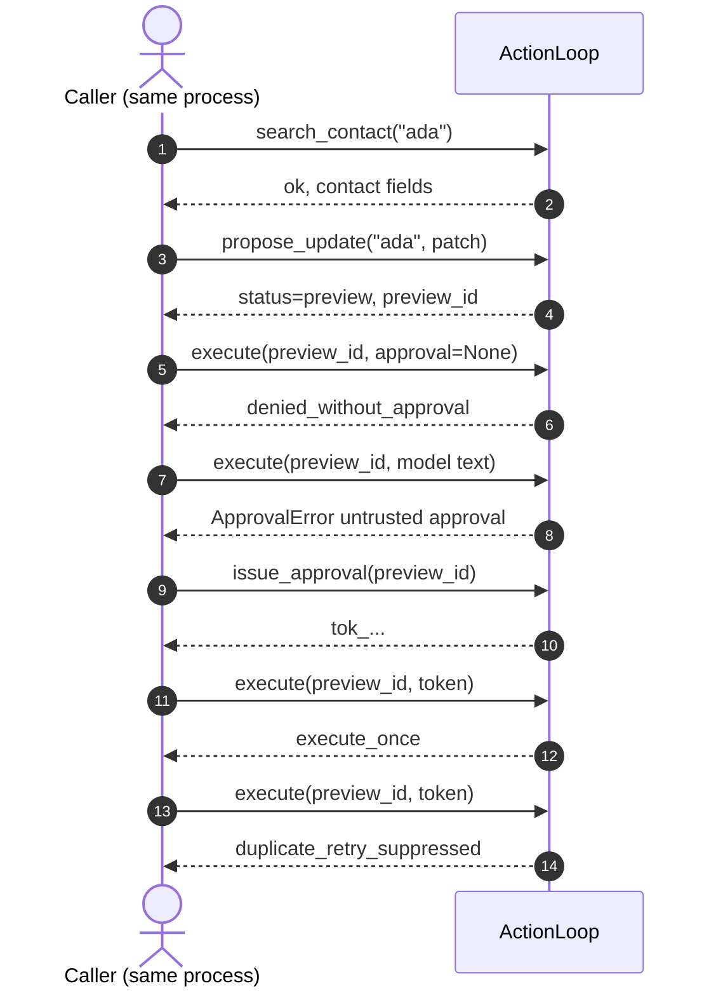
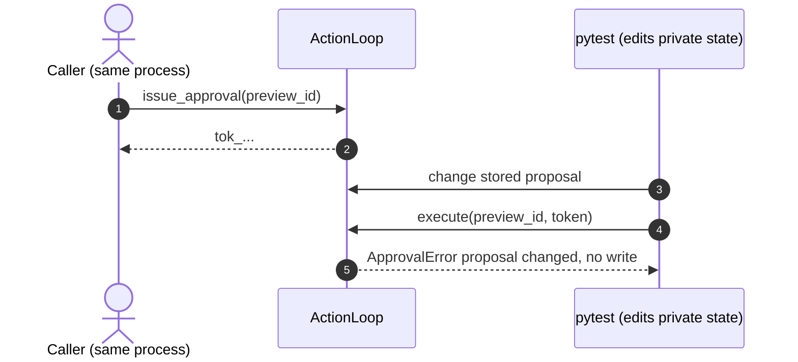
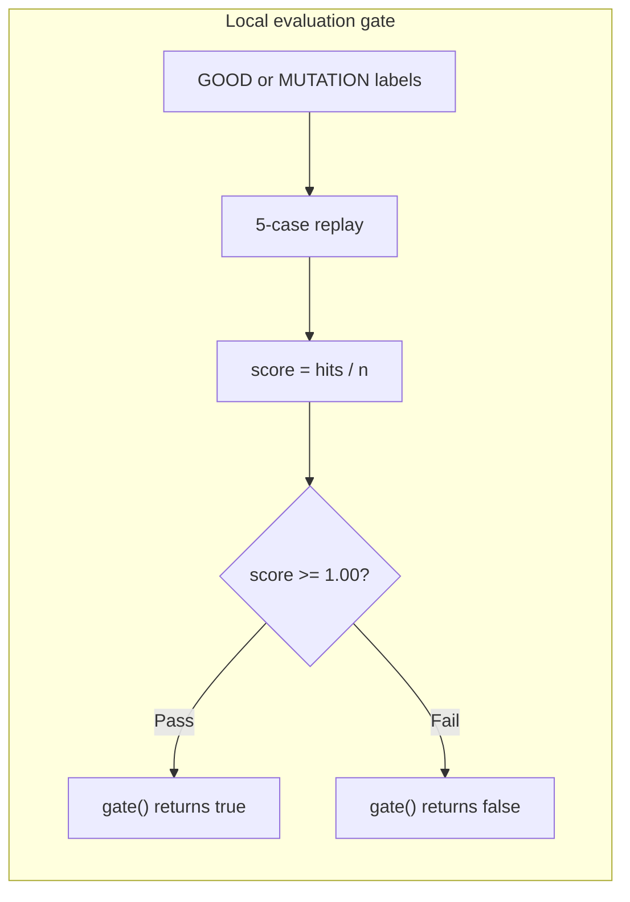

# llm-reviewer-path

**Run an evaluation gate, reject an unapproved write, and inspect a duplicate retry.** A small offline index for applied AI and backend engineering: 21 tests, local fixtures, no API keys. Tests run without network access after setup.

This repository is an index, not a product. [DocExtract](https://github.com/ChunkyTortoise/docextract) stays the production system for the eval and retrieval claims below.

[](https://github.com/ChunkyTortoise/llm-reviewer-path/actions/workflows/ci.yml)

[Run the offline checks](#run) · [Read the captured receipt](docs/offline-receipt.md)

<p align="center">
  
</p>

The figure summarizes actual local output from the replay, plus one panel labeled `Internal-state test` that comes from pytest only. It is an editorial diagram, not a product screenshot. [Read the receipt and its limits](docs/offline-receipt.md).

## Run

Python 3.10 or newer, and [uv](https://docs.astral.sh/uv/getting-started/installation/). There is no Makefile. The commands match `pyproject.toml` (`requires-python`, dev group `pytest>=8`, `addopts = "-q"`) and [`.github/workflows/ci.yml`](.github/workflows/ci.yml) (`uv sync --group dev`, then `uv run pytest`).

```bash
git clone https://github.com/ChunkyTortoise/llm-reviewer-path.git
cd llm-reviewer-path
uv sync --group dev
uv run pytest
uv run python -m receipts.replay
```

`uv.lock` pins pytest 9.1.1. Quiet mode hides the platform and Python banner. The replay prints the eval scores and the approval sequence, without tokens or random IDs. Its output is in [the receipt](docs/offline-receipt.md) and a test checks they match.

<details>
<summary><b>Expected terminal output (21 passed)</b></summary>

80-column capture. The stable result is `21 passed`. The seconds value moves (this capture was 0.33s).

```text
.....................                                                    [100%]
21 passed in 0.33s
```

| File | Tests |
|---|---:|
| `tests/test_eval_gate.py` | 3 |
| `tests/test_hard_action.py` | 10 |
| `tests/test_missing_fixture_fails_closed.py` | 1 |
| `tests/test_replay.py` | 2 |
| `tests/test_retrieval_failure_modes.py` | 5 |
| **Total** | **21** |

</details>

> **Evidence boundary:** This repository is an index, not a product or a RAG app. It documents the offline tests and receipts below. It does not claim unlisted production behavior, client details, metrics, or features. The scope figures below are copied historical claims, not measurements reproduced here. The local eval gate is a boolean on 5 fixtures. It is not branch protection on DocExtract.

## Walk (10 minutes)

1. Run `uv sync --group dev`, `uv run pytest` (expect `21 passed`) and `uv run python -m receipts.replay`.
2. Eval gate: `GOOD` passes, `MUTATION` fails, an unknown id raises `KeyError`.
3. Hard action: denied without a token, `ApprovalError` on model text, `execute_once`, then `duplicate_retry_suppressed`.
4. Retrieval: five fixture ids in `receipts/retrieval_failure_modes/cases.py`.
5. Scope: read `receipts/fde_scope/ACUITY.md`. Read the provenance table before treating any parent number as a result from this repo.

## JD matrix

| Hiring signal | What the local receipt shows | Command or file | Parent proof |
|---|---|---|---|
| Eval as a CI check | 5 labels, floor `1.00`. `GOOD` scores 1.00 and `gate()` is true. `MUTATION` labels the injection case as clean, scores 0.80, and `gate()` is false. An unknown case id raises `KeyError` (fails closed). | `uv run pytest tests/test_eval_gate.py tests/test_missing_fixture_fails_closed.py` (4 tests) | DocExtract [replay](https://github.com/ChunkyTortoise/docextract/blob/main/scripts/eval_offline_replay.py). Full parent sources and dated observations are in [Provenance](#provenance). |
| Approval boundary on writes | `search_contact` needs no token. `propose_update` returns a preview. `execute` with no token returns `denied_without_approval`. Model-written approval text raises `ApprovalError`. `issue_approval` mints a token; `execute` with that token returns `execute_once` once, then `duplicate_retry_suppressed`. The compare uses `secrets.compare_digest`. The contact row is in memory, not a live CRM call. | `uv run pytest tests/test_hard_action.py` (10 tests); `uv run python -m receipts.replay` | None. The approval-token boundary is local to this index. |
| Retrieval failure modes | Mock `classify()` on 5 fixtures: `empty_retrieval`, `conflicting_evidence`, `prompt_injection`, `malformed_structured_output`, and one clean pass. No network. | `uv run pytest tests/test_retrieval_failure_modes.py` (5 tests) | [ADR-0020](https://github.com/ChunkyTortoise/docextract/blob/main/docs/adr/0020-indirect-prompt-injection-defense.md), [failure analysis](https://github.com/ChunkyTortoise/docextract/blob/main/docs/eval-failure-analysis.md), [`injection_guard.py`](https://github.com/ChunkyTortoise/docextract/blob/main/app/services/injection_guard.py). The local `retriever.py` is a mock, not that guard. |
| Field-engineering scope | Redacted scope note: problem, constraints, first slice, exclusions, kill-check, handoff. Pytest does not collect it. Its 500+ figure is client-reported. The 1,700+ tests and 226 workflows are copied historical figures from a non-public source, not reproduced here. | [`receipts/fde_scope/ACUITY.md`](receipts/fde_scope/ACUITY.md) | Source repo is not public (HTTP 404). The markdown here is the receipt. |

## Architecture and approval boundaries

### Hard-action receipt

`receipts/hard_action/loop.py` isolates a write behind an approval token. Reads stay open. A preview is not an execution. Text from the model is not a token. A used token cannot run the write again. The updated row lives in an in-memory dict. This is a single-process teaching example, not a production authorization service. Approval issuance is callable by the same Python process; callers must supply that trust boundary. Incoming and returned patches are copied. A token is bound to a snapshot of its target query and patch; changing the stored proposal after approval raises `ApprovalError` before any write. Durable storage, concurrent execution, token expiry and a separately authenticated approver remain outside this example.


```mermaid
sequenceDiagram
    autonumber
    actor Caller as Caller (same process)
    participant Boundary as ActionLoop

    Caller->>Boundary: search_contact("ada")
    Boundary-->>Caller: ok, contact fields

    Caller->>Boundary: propose_update("ada", patch)
    Boundary-->>Caller: status=preview, preview_id

    Caller->>Boundary: execute(preview_id, approval=None)
    Boundary-->>Caller: denied_without_approval

    Caller->>Boundary: execute(preview_id, model text)
    Boundary-->>Caller: ApprovalError untrusted approval

    Caller->>Boundary: issue_approval(preview_id)
    Boundary-->>Caller: tok_...

    Caller->>Boundary: execute(preview_id, token)
    Boundary-->>Caller: execute_once

    Caller->>Boundary: execute(preview_id, token)
    Boundary-->>Caller: duplicate_retry_suppressed
```

The diagram above summarizes the replay. The same caller issues and uses the token in one process; there is no separately authenticated approver. The changed-proposal rejection is a separate scenario. It is an internal-state test in `tests/test_hard_action.py`, not part of the replay, and it does not happen after the successful execution above:


```mermaid
sequenceDiagram
    autonumber
    actor Caller as Caller (same process)
    participant Boundary as ActionLoop
    participant Test as pytest (edits private state)

    Caller->>Boundary: issue_approval(preview_id)
    Boundary-->>Caller: tok_...
    Test->>Boundary: change stored proposal
    Test->>Boundary: execute(preview_id, token)
    Boundary-->>Test: ApprovalError proposal changed, no write
```

### Eval-gate receipt

`receipts/eval_gate/gate.py` scores five local labels. `gate()` returns true only when `score >= 1.00`. Default CI on this repo stays green because the mutation test expects `gate()` to be false. That is a different demonstration from DocExtract PR #32, which was open with a red workflow run (observed 2026-09-23, historical).


```mermaid
flowchart LR
    subgraph Gate["Local evaluation gate"]
        Cand["GOOD or MUTATION labels"] --> Replay["5-case replay"]
        Replay --> Eval["score = hits / n"]
        Eval --> Floor{"score >= 1.00?"}
        Floor -->|Pass| Allow["gate() returns true"]
        Floor -->|Fail| Block["gate() returns false"]
    end
```

Unknown case ids never reach that floor check. `evaluate()` raises `KeyError` first (`tests/test_missing_fixture_fails_closed.py`).

## Provenance

Parent links were checked against DocExtract `main` and the public GitHub account on 2026-09-23 and not re-checked since. Local Python behavior was verified on 2026-10-01 using an existing environment (see the receipt). Historical observations from 2026-09-23: PR #32 was open and red, and DocExtract recorded a 2026-09-19 finding that its default branch was unprotected. This pass did not refresh those observations or change branch protection.

| Claim | Source | Taken from the parent | Added in this repo |
|---|---|---|---|
| Eval gate | DocExtract [`scripts/eval_offline_replay.py`](https://github.com/ChunkyTortoise/docextract/blob/main/scripts/eval_offline_replay.py), [`scripts/eval_gate.py`](https://github.com/ChunkyTortoise/docextract/blob/main/scripts/eval_gate.py), [`docs/eval-gate-proof.md`](https://github.com/ChunkyTortoise/docextract/blob/main/docs/eval-gate-proof.md), [`eval-gate.yml`](https://github.com/ChunkyTortoise/docextract/blob/main/.github/workflows/eval-gate.yml), [PR #32](https://github.com/ChunkyTortoise/docextract/pull/32) | Offline replay as a CI check, and a public red regression | 5-label floor at 1.00. The mutation is asserted here, so this repo's CI stays green. |
| Retrieval failure modes | DocExtract [ADR-0020](https://github.com/ChunkyTortoise/docextract/blob/main/docs/adr/0020-indirect-prompt-injection-defense.md), [`docs/eval-failure-analysis.md`](https://github.com/ChunkyTortoise/docextract/blob/main/docs/eval-failure-analysis.md) | Indirect prompt injection in untrusted document text | Local mock and five fixtures: empty, conflict, injection, malformed, clean |
| Hard action | `receipts/hard_action/loop.py` | No DocExtract parent | Approval token, denial, `compare_digest`, one execution, duplicate suppression |
| FDE scoping | [`receipts/fde_scope/ACUITY.md`](receipts/fde_scope/ACUITY.md) | `ChunkyTortoise/jorge_real_estate_bots` is not public (HTTP 404). `METRICS-SOT.md` is not in this repo. | Redacted markdown only. Not a pytest. 500+ is client-reported; 1,700+ tests and 226 workflows are copied historical figures, not reproduced here. |
